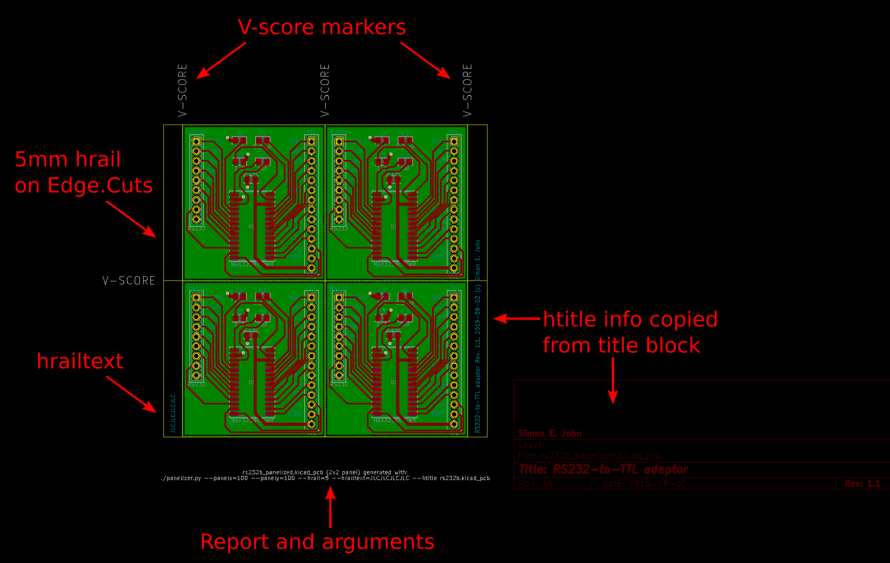
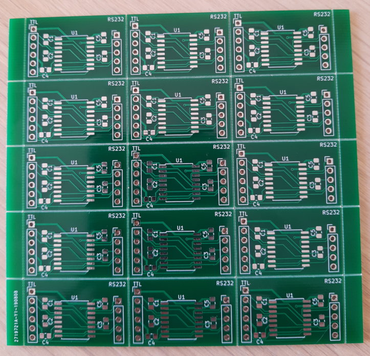

# kicad-panelizer
A simple script to create a v-scored panel of a KiCad board.

To use:
1. Ensure you have KiCad 5.1.2+ installed
2. Clone script to an appropriate location
3. Open a terminal and `cd` to the directory of the script
4. Run it with python3: `./panelizer.py --panelx=100 --panely=100 /path/to/source_board.kicad_pcb`
5. Panelized output will be saved to the same directory as the source board, with the name `{sourceboardname}_panelized.kicad_pcb`

### CLI Arguments:

Switch | Explanation
------ | -----------
```--panelx=100``` | Maximum width of panel in mm to fit as many boards as possible to
```--panely=100``` | Maximum height of panel in mm to fit as many boards as possible to
```--numx=2``` | Number of boards in the panel horizontally (conflicts with ```--panelx/panely```)
```--numy=2``` | Number of boards in the panel vertically (conflicts with ```--panelx/panely```)
```--hrail=5``` | Width in mm of left/right edge rails
```--vrail=5``` | Width in mm of top/bottom edge rails (not recommended to use with ```--hrail```)
```--hrailtext="text on hrail"``` | Text to put on left hrail
```--vrailtext="text on vrail"``` | Text to put on top vrail
```--htitle``` | Output title block fields (Title, Company, Revision, Date) on right hrail
```--vtitle``` | Output title block fields (Title, Company, Revision, Date) on bottom vrail
```--vscorelayer``` | Layer to put v-score lines on, defaults to Edge.Cuts
```--vscoretextlayer``` | Layer to put v-score text on, defaults to Cmts.User
```--vscoretext``` | Text used to indicate v-scores, defaults to V-SCORE
```--vscoreextends``` | How far past the board in mm to extend the v-scores, defaults to -0.05 (no extension)

### Example output:





### Hints & Tips:

If you don't use Edge.Cuts as your ```V_SCORE_LAYER``` don't refill zones when exporting the gerbers as Kicad will essentially merge your panel into a single board.

PCBWay, [Seeed](http://support.seeedstudio.com/knowledgebase/articles/388503-what-are-the-pcb-panelization-rules) and [JLCPCB](https://support.jlcpcb.com/article/49-pcb-panelization) like v-scores to be on the Edge.Cuts layer. In this case Kicad seems to cope with zones being refilled, however the 3d viewer can't figure out the board outline. Also it will fail the DRC due to the board outline not being a polygon. I would set ```V_SCORE_LINE_LENGTH_BEYOND_BOARD``` to -0.05 in this case, so that the v-scores meet in the middle of the default 0.1mm lines rather than extending past the panel.

[Elecrow](https://www.elecrow.com/download/How-to-Reduce-Cost-with-Panelizing-Service.pdf) apparently will accept v-scores in the Edge.Cuts (.GKO) layer or silkscreen layer if you put a comment on the silkscreen layer, so you should call with ```--vscoretextlayer=F.SilkS --vscoretext=V-CUT```

Panelizer will warn you if the panel is under 70x70mm which is the minimum size JLCPCB can v-cut.

[JLCPCB](https://support.jlcpcb.com/article/28-how-to-remove-order-number-from-your-pcb) offer the facility to specify where to put the order number, for example hidden under an IC instead of somewhere random on your silkscreen. If you call panelizer with ```--vrailtext=JLCJLCJLCJLC``` it will put it on the vrail instead.

Please submit feature requests and bug reports via GitHub [issues](https://github.com/sej7278/kicad-panelizer/issues).
